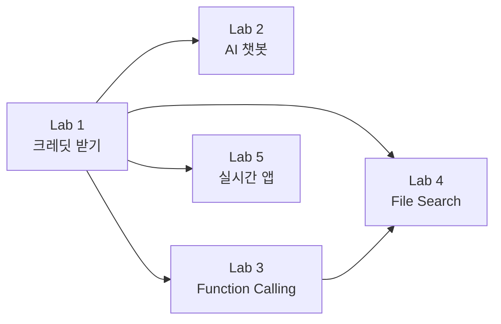
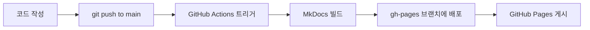

# Hands-on Labs for Startups using Microsoft Azure & Azure AI

[](https://opensource.org/licenses/MIT)
[](https://asomi7007.github.io/Hands-on-labs-for-startups-using-Microsoft-Azure-Azure-AI/)
[](https://www.mkdocs.org/)

스타트업을 위한 Microsoft Azure 및 Azure AI 핸즈온 워크샵 시리즈입니다. 이 워크샵을 통해 Azure의 핵심 서비스와 AI 기능을 실제로 구현하고 배포하는 방법을 배울 수 있습니다.

> **워크샵 문서**: [https://asomi7007.github.io/Hands-on-labs-for-startups-using-Microsoft-Azure-Azure-AI/](https://asomi7007.github.io/Hands-on-labs-for-startups-using-Microsoft-Azure-Azure-AI/)

---

## 📚 Workshop Overview

스타트업 개발자와 엔지니어를 위한 실전 중심의 Azure 워크샵입니다. 각 Lab은 독립적으로 진행할 수 있으며, Azure 크레딧을 효율적으로 활용하여 실제 프로덕션 환경을 구축하는 방법을 다룹니다.

### What you will learn

- ✅ **Azure 크레딧 받기 및 관리**: 스타트업을 위한 무료 크레딧 활용법
- ✅ **AI 에이전트 구축**: Azure AI Foundry를 사용한 Function Calling, File Search, Code Interpreter
- ✅ **풀스택 개발**: WordPress + Azure AI 챗봇 통합
- ✅ **실시간 협업 앱**: WebSocket 기반 Affinity Diagram 보드
- ✅ **DevOps & CI/CD**: GitHub Actions, Docker, Azure Container Apps
- ✅ **보안 및 인증**: OIDC, Managed Identity, Azure Key Vault

---

## 🎯 Workshop Labs

| Lab | 제목 | 설명 | 예상 시간 |
|-----|------|------|----------|
| **Lab 1** | [Azure 크레딧 받기](./docs/lab1/) | Azure 계정 생성 및 스타트업 크레딧 신청 | 15분 |
| **Lab 2** | [AI 챗봇 구축](./docs/lab2/) | WordPress + Azure AI 챗봇 통합 | 120분 |
| **Lab 3** | [Function Calling](./docs/lab3/) | Azure OpenAI Function Calling 구현 | 60분 |
| **Lab 4** | [File Search & Code Interpreter](./docs/lab4/) | AI 에이전트 고급 기능 | 60분 |
| **Lab 5** | [실시간 협업 앱 배포](./docs/lab5/) | Affinity Diagram + Azure Container Apps | 90분 |

> 💡 각 Lab은 독립적으로 진행 가능하며, Lab 1(크레딧 받기)은 필수입니다.

---

## 🚀 Getting Started

### Prerequisites

이 워크샵을 진행하려면 다음이 필요합니다:

1. **Azure 계정**: 무료 계정 또는 스타트업 크레딧 ([Lab 1](./docs/lab1/) 참고)
2. **GitHub 계정**: Codespaces 및 Actions 사용
3. **기본 지식**:
   - Python 또는 JavaScript 기본 문법
   - Git 기본 명령어
   - 터미널/커맨드라인 사용법

### 워크샵 시작하기

#### 옵션 1: GitHub Codespaces (권장)

```bash
# 1. 이 저장소를 포크
# 2. Codespaces 생성
# 3. 자동으로 환경 설정 완료!
```

#### 옵션 2: 로컬 환경

```bash
# 저장소 클론
git clone https://github.com/asomi7007/Hands-on-labs-for-startups-using-Microsoft-Azure-Azure-AI.git
cd Hands-on-labs-for-startups-using-Microsoft-Azure-Azure-AI

# Python 가상 환경 생성
python -m venv .venv

# 가상 환경 활성화
# Windows:
.venv\Scripts\activate
# macOS/Linux:
source .venv/bin/activate

# 의존성 설치
pip install -r requirements.txt

# MkDocs 개발 서버 실행
mkdocs serve
```

브라우저에서 http://127.0.0.1:8000 접속

---

## 📖 Workshop Guide

자세한 워크샵 가이드는 [https://asomi7007.github.io/Hands-on-labs-for-startups-using-Microsoft-Azure-Azure-AI/](https://asomi7007.github.io/Hands-on-labs-for-startups-using-Microsoft-Azure-Azure-AI/)에서 확인하세요.

### 권장 진행 순서



---

## 🛠️ Repository Structure

```
.
├── docs/                      # 워크샵 문서 (MkDocs)
│   ├── lab1/                 # Lab 1: Azure 크레딧
│   ├── lab2/                 # Lab 2: AI 챗봇
│   ├── lab3/                 # Lab 3: Function Calling
│   ├── lab4/                 # Lab 4: File Search
│   ├── lab5/                 # Lab 5: 실시간 협업 앱
│   ├── css/                  # 커스텀 스타일
│   ├── js/                   # 커스텀 스크립트
│   └── media/                # 이미지 및 미디어
├── .github/
│   └── workflows/
│       └── deploy.yml        # GitHub Pages 자동 배포
├── mkdocs.yml                # MkDocs 설정
├── requirements.txt          # Python 의존성
├── LICENSE                   # MIT 라이선스
└── README.md                 # 이 파일
```

---

## 🌐 GitHub Pages 배포

이 저장소는 자동으로 GitHub Pages에 배포됩니다.

### 자동 배포 흐름



### 수동 배포 (로컬)

```bash
# MkDocs로 GitHub Pages 배포
mkdocs gh-deploy --force
```

배포 후 Settings → Pages → gh-pages 브랜치 선택

---

## 💡 Important Security Notice

이 워크샵의 샘플 코드와 설정은 **학습 목적**으로 제작되었습니다. 프로덕션 환경에 배포하기 전에 반드시 추가 보안 조치를 구현하세요.

### 보안 권장사항

- ✅ Azure Key Vault로 비밀키 관리
- ✅ Managed Identity 사용
- ✅ 네트워크 액세스 제한 (NSG, Private Endpoints)
- ✅ Application Insights로 모니터링
- ✅ 정기적인 보안 업데이트

자세한 내용은 [Azure 보안 모범 사례](https://learn.microsoft.com/azure/developer/ai/get-started-securing-your-ai-app)를 참고하세요.

> ⚠️ **Warning**: 일부 기능은 미리보기 상태입니다. 프로덕션 워크로드에는 권장되지 않습니다.

---

## 🤝 Contributing

워크샵 개선을 위한 여러분의 의견과 제안을 환영합니다!

### 기여 방법

1. 이 저장소를 포크합니다
2. 새로운 브랜치를 생성합니다 (`git checkout -b feature/AmazingFeature`)
3. 변경사항을 커밋합니다 (`git commit -m 'Add some AmazingFeature'`)
4. 브랜치에 푸시합니다 (`git push origin feature/AmazingFeature`)
5. Pull Request를 생성합니다

### 이슈 제보

- 버그 리포트: [Issues](https://github.com/asomi7007/Hands-on-labs-for-startups-using-Microsoft-Azure-Azure-AI/issues)
- 기능 제안: [Discussions](https://github.com/asomi7007/Hands-on-labs-for-startups-using-Microsoft-Azure-Azure-AI/discussions)

---

## 📄 License

이 프로젝트는 MIT 라이선스를 따릅니다. 자세한 내용은 [LICENSE](LICENSE) 파일을 참고하세요.

---

## 🔗 Resources

### Azure 공식 문서

- [Azure Documentation](https://docs.microsoft.com/azure/)
- [Azure AI Services](https://azure.microsoft.com/services/cognitive-services/)
- [Azure Container Apps](https://azure.microsoft.com/services/container-apps/)

### 추가 학습 자료

- [Microsoft Learn - Azure Fundamentals](https://learn.microsoft.com/training/paths/azure-fundamentals/)
- [Azure Architecture Center](https://learn.microsoft.com/azure/architecture/)
- [Azure AI Foundry](https://learn.microsoft.com/azure/ai-studio/)

### 커뮤니티

- [Azure Tech Community](https://techcommunity.microsoft.com/t5/azure/ct-p/Azure)
- [Microsoft Q&A](https://learn.microsoft.com/answers/products/azure)

---

## 🏷️ Topics

`azure` `azure-ai` `workshop` `hands-on-lab` `startup` `mkdocs` `github-pages` `ai-agents` `fullstack` `devops` `ci-cd`

---

## 📊 Statistics


---

## 👥 Maintainers

- [@asomi7007](https://github.com/asomi7007) - Workshop Creator & Maintainer

---

**Happy Learning! 🚀**

프로젝트에 관심을 가져주셔서 감사합니다. 이 워크샵이 여러분의 Azure 여정에 도움이 되기를 바랍니다!
