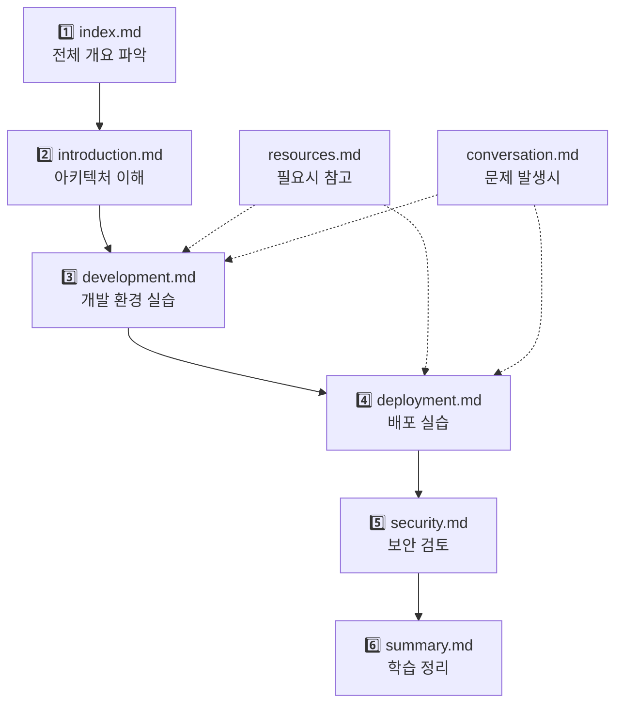
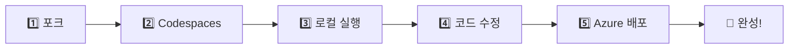
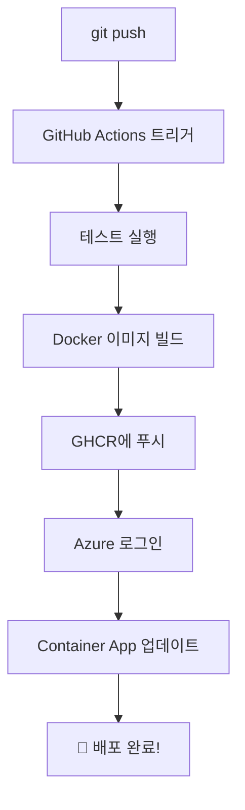

# Lab 5 · Affinity Diagram Web App - 실시간 협업 보드 만들기

**실시간 협업 포스트잇 보드**를 만들면서 배우는 풀스택 개발 & 클라우드 배포 핸즈온!

> 💡 **이 워크샵에서 배우는 것:**  
> GitHub에서 포크 → Codespaces로 개발 → Docker 빌드 → GitHub Actions CI/CD → Azure 배포까지  
> **전체 DevOps 파이프라인을 직접 체험**합니다!

## 🎯 핸즈온 목표

1. ✅ **GitHub Codespaces**에서 클라우드 개발 환경 체험
2. ✅ **FastAPI (Python) + React (TypeScript)** 풀스택 앱 실행
3. ✅ **WebSocket 실시간 동기화** - 여러 사용자가 동시에 편집
4. ✅ **Docker 멀티 스테이지 빌드**로 프로덕션 이미지 생성
5. ✅ **GitHub Actions**로 자동 CI/CD 파이프라인 구축
6. ✅ **Azure Container Apps**에 실제 배포 및 URL 접속

## 📚 프로젝트 소개

### 어피니티 다이어그램이란?

어피니티 다이어그램(Affinity Diagram)은 브레인스토밍으로 나온 아이디어를 포스트잇에 적고, 유사한 것끼리 그룹화하여 패턴을 발견하는 **UX 디자인 방법론**입니다. 이 앱은 이 과정을 **실시간 온라인 협업**으로 구현했습니다.

### 핵심 기능

- 🔄 **실시간 협업**: WebSocket으로 여러 사용자가 동시 작업
- 📝 **포스트잇 관리**: 드래그 앤 드롭으로 자유롭게 배치
- 📊 **2x2 매트릭스**: 중요도/긴급도 등 기준으로 분류
- 🌐 **한글 완벽 지원**: IME(Input Method Editor) 처리로 자모 분리 없음
- 🎨 **5가지 색상**: 주제별로 색상 구분
- 📌 **포스트잇 고정**: 실수로 이동되지 않도록 고정 기능

## 📚 학습 진행 순서 안내

이 워크샵은 **점진적 학습(Progressive Disclosure)** 원칙을 따릅니다.  
각 단계에서 필요한 만큼만 배우고, 더 깊이 알고 싶을 때 다음 문서로 넘어가세요!



### 권장 학습 경로

| 순서 | 문서 | 목적 | 소요 시간 |
|------|------|------|----------|
| **1** | **[index.md](./index.md)** 👈 지금 여기! | 전체 개요와 빠른 시작 가이드 | 5분 |
| **2** | **[introduction.md](./introduction.md)** | 기술 스택, 아키텍처 상세 설명 | 15분 |
| **3** | **[development.md](./development.md)** | Codespaces 설정, 로컬 개발 실습 | 25분 |
| **4** | **[deployment.md](./deployment.md)** | Azure 배포, CI/CD 파이프라인 구축 | 30분 |
| **5** | **[security.md](./security.md)** | OIDC 인증, Secrets 관리, 보안 강화 | 10분 |
| **6** | **[summary.md](./summary.md)** | 학습 정리, 다음 단계 제안 | 5분 |
| | **[resources.md](./resources.md)** | 공식 문서, 명령어 모음 (필요시 참고) | - |
| | **[conversation.md](./conversation.md)** | FAQ, 트러블슈팅 (문제 발생시) | - |

> 💡 **Tip**: 숙련자는 3번(development.md)부터 시작해도 됩니다!

## 🏗️ 기술 스택 (간략)

- **Frontend**: React 18 + TypeScript + Vite + Tailwind CSS
- **Backend**: FastAPI + WebSocket + Uvicorn
- **DevOps**: Docker + GitHub Actions + Azure Container Apps

> 📖 각 기술의 역할과 아키텍처는 **[introduction.md](./introduction.md)**에서 상세히 다룹니다.

## 사전 점검

> 이 랩은 클라우드 기반 개발 환경을 활용하므로 로컬 개발 도구 설치가 필요 없습니다.

- **GitHub 계정**: 저장소 포크와 Codespaces 사용을 위해 필요합니다.
- **Azure 계정 및 활성 구독**: Container Apps 배포를 위해 필요하며, Lab 1에서 받은 크레딧을 사용할 수 있습니다.
- **최신 브라우저**: Chrome, Edge, Firefox 최신 버전 권장

## 🚀 핸즈온 시작하기 (5단계)

### 전체 흐름



### 1️⃣ Step 1: GitHub 저장소 포크하기

**포크란?** 다른 사람의 저장소를 내 계정으로 복사하는 것입니다.

1. [원본 저장소](https://github.com/asomi7007/affinity-app) 접속
2. 우측 상단 **Fork** 버튼 클릭
3. **Create fork** 클릭하여 본인 계정에 복사

> 💡 포크가 완료되면 URL이 `https://github.com/YOUR_USERNAME/affinity-app`로 바뀝니다.

### 2️⃣ Step 2: GitHub Codespaces 실행하기

**Codespaces란?** GitHub이 제공하는 클라우드 개발 환경입니다. 브라우저에서 VS Code를 실행하여 아무것도 설치하지 않고 바로 개발할 수 있습니다!

1. 포크한 저장소에서 초록색 **<> Code** 버튼 클릭
2. **Codespaces** 탭 선택
3. **Create codespace on main** 클릭
4. ⏳ 2-3분 대기 (자동으로 VS Code 환경이 열림)

**자동으로 설정되는 것들:**
```bash
✅ Python 3.12 + Node.js 18 설치
✅ VS Code 확장 (Python, ESLint, Tailwind CSS 등)
✅ 백엔드 의존성 (pip install)
✅ 프론트엔드 의존성 (npm install)
✅ 환경 변수 자동 생성 (.env.local)
✅ 포트 포워딩 (5173, 8000) Public 설정
```

### 3️⃣ Step 3: 로컬 개발 서버 실행하기

Codespaces 터미널에서 실행:

```bash
# 한 줄로 백엔드 + 프론트엔드 실행
./start.sh
```

**실행 결과:**
```
🚀 Affinity Diagram 개발 서버 시작
━━━━━━━━━━━━━━━━━━━━━━━━━━━━━━━━━━

✅ 백엔드 서버 시작 중... (포트 8000)
✅ 프론트엔드 서버 시작 중... (포트 5173)

━━━━━━━━━━━━━━━━━━━━━━━━━━━━━━━━━
🎉 서버가 실행 중입니다!

📱 프론트엔드: http://localhost:5173
🔌 백엔드 API: http://localhost:8000
📚 API 문서: http://localhost:8000/docs
━━━━━━━━━━━━━━━━━━━━━━━━━━━━━━━━━
```

**브라우저에서 앱 열기:**
1. VS Code 하단 **PORTS** 탭 클릭
2. 포트 5173 옆 지구본 🌐 아이콘 클릭
3. 새 탭에서 Affinity Diagram 앱이 열림

> ⚠️ **중요**: WebSocket이 작동하려면 포트 8000도 **Public**이어야 합니다.

### 4️⃣ Step 4: 코드 수정하고 Git Push하기

**타이틀 변경 예제** (`frontend/index.html`):
```html
<!-- 변경 전 -->
<title>Affinity Diagram</title>

<!-- 변경 후 -->
<title>나의 협업 보드 - Affinity Diagram</title>
```

**Git 커밋 & 푸시:**
```bash
git add frontend/index.html
git commit -m "✨ feat: 타이틀 수정"
git push origin main
```

### 5️⃣ Step 5: Azure에 자동 배포하기

```bash
# Azure 배포 자동 설정
./scripts/setup-azure-cicd.sh
```

대화형 프롬프트를 따라 Azure 리소스를 생성하고 CI/CD를 설정합니다.

**배포 파이프라인 흐름:**


## ✅ 실습 진행 체크리스트

각 단계를 완료할 때마다 체크하세요!

### 📦 준비 단계
- [ ] GitHub 저장소 포크
- [ ] Codespaces 생성 및 실행

### 💻 개발 실습
- [ ] `./start.sh`로 로컬 서버 실행
- [ ] 브라우저에서 앱 접속 확인
- [ ] 포스트잇 생성/수정/이동 테스트
- [ ] 한글 입력 테스트 (자모 분리 없는지 확인)
- [ ] 새 브라우저 탭에서 실시간 동기화 확인

### 🚀 배포 실습
- [ ] 코드 수정 (타이틀 변경 등)
- [ ] Git 커밋 및 푸시
- [ ] Azure CI/CD 설정
- [ ] GitHub Actions 실행 확인
- [ ] 배포된 Azure URL 접속

> 🎯 **완료 확인**: 모든 단계를 마쳤다면 **[summary.md](./summary.md)**에서 학습 성과를 점검하세요!

## ⏱️ 실습 예상 시간

| 단계 | 시간 |
|------|------|
| **전체 워크샵** | 약 **90분** (초보자 기준) |
| **핵심 실습만** | 약 **40분** (숙련자) |

> 💡 막히는 부분이 있다면 [conversation.md](./conversation.md)의 FAQ를 확인하세요!

---

## 🚀 시작하기

준비되셨나요? 이제 **[introduction.md](./introduction.md)**로 이동하여 아키텍처를 이해하고,  
**[development.md](./development.md)**에서 본격적인 실습을 시작하세요!

> 🎯 바로 실습을 시작하고 싶다면 → **[development.md](./development.md)**로 이동
