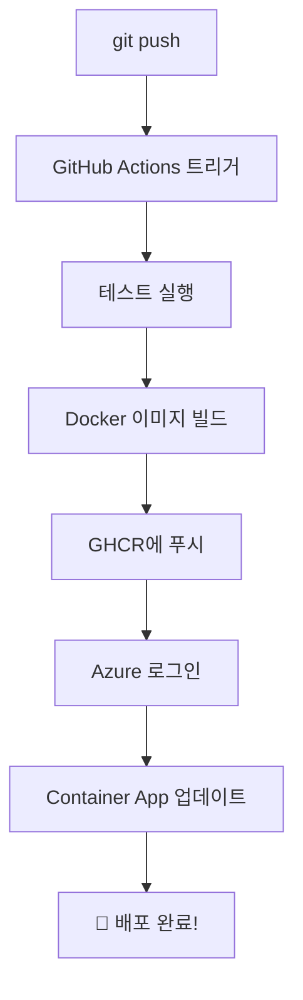

# Lab 5 · Affinity Diagram Web App - 실시간 협업 보드 만들기

**실시간 협업 포스트잇 보드**를 만들면서 배우는 풀스택 개발 & 클라우드 배포 핸즈온!

> 💡 **이 워크샵에서 배우는 것:**  
> GitHub에서 포크 → Codespaces로 개발 → Docker 빌드 → GitHub Actions CI/CD → Azure 배포까지  
> **전체 DevOps 파이프라인을 직접 체험**합니다!

## 🎯 핸즈온 목표

1. ✅ **GitHub Codespaces**에서 클라우드 개발 환경 체험
2. ✅ **FastAPI (Python) + React (TypeScript)** 풀스택 앱 실행
3. ✅ **WebSocket 실시간 동기화** - 여러 사용자가 동시에 편집
4. ✅ **Docker 멀티 스테이지 빌드**로 프로덕션 이미지 생성
5. ✅ **GitHub Actions**로 자동 CI/CD 파이프라인 구축
6. ✅ **Azure Container Apps**에 실제 배포 및 URL 접속

## 📚 프로젝트 소개

### 어피니티 다이어그램이란?

어피니티 다이어그램(Affinity Diagram)은 브레인스토밍으로 나온 아이디어를 포스트잇에 적고, 유사한 것끼리 그룹화하여 패턴을 발견하는 **UX 디자인 방법론**입니다. 이 앱은 이 과정을 **실시간 온라인 협업**으로 구현했습니다.

### 핵심 기능

- 🔄 **실시간 협업**: WebSocket으로 여러 사용자가 동시 작업
- 📝 **포스트잇 관리**: 드래그 앤 드롭으로 자유롭게 배치
- 📊 **2x2 매트릭스**: 중요도/긴급도 등 기준으로 분류
- 🌐 **한글 완벽 지원**: IME(Input Method Editor) 처리로 자모 분리 없음
- 🎨 **5가지 색상**: 주제별로 색상 구분
- 📌 **포스트잇 고정**: 실수로 이동되지 않도록 고정 기능

## 문서 구조 안내

랩 5 콘텐츠는 실습 흐름에 맞춰 여러 문서로 나뉘어 있습니다. 필요한 주제를 빠르게 찾아볼 수 있도록 아래 페이지를 참고하세요.

- **[Introduction](./introduction.md)**: 프로젝트 상세 개요, 아키텍처, 실시간 동기화 작동 원리를 소개합니다.
- **[Development](./development.md)**: GitHub 포크부터 Codespaces 실행, 로컬 개발 환경 구축, 앱 사용 방법까지 단계별 실습을 안내합니다.
- **[Deployment](./deployment.md)**: Azure 배포 설정, CI/CD 파이프라인 구성, Docker 멀티 스테이지 빌드, 배포 확인까지의 전 과정을 다룹니다.
- **[Security](./security.md)**: GitHub Secrets, Azure 권한 관리, OIDC 인증, 프로덕션 보안 강화 등을 정리했습니다.
- **[Resources](./resources.md)**: 공식 문서, 추가 학습 자료, 유용한 명령어, 관련 링크 모음을 제공합니다.
- **[Conversation](./conversation.md)**: 자주 묻는 질문, 디버그 팁, 문제 해결 가이드를 다룹니다.
- **[Summary](./summary.md)**: 완료 후 점검 항목, 기능 확장 아이디어, 다음 단계 추천 작업을 제공합니다.

## 🏗️ 기술 스택 및 아키텍처

### Frontend 기술
- **React 18**: Concurrent 기능, 자동 배칭
- **TypeScript**: 타입 안정성 및 IntelliSense
- **Vite**: 번개같이 빠른 HMR (Hot Module Replacement)
- **Tailwind CSS**: 유틸리티 우선 스타일링
- **Framer Motion**: 부드러운 드래그 애니메이션

### Backend 기술
- **FastAPI**: 고성능 비동기 웹 프레임워크
- **WebSocket**: 양방향 실시간 통신
- **Pydantic**: 데이터 검증 및 JSON 직렬화
- **Uvicorn**: ASGI 서버

### DevOps 기술
- **Docker**: 멀티 스테이지 빌드로 최적화
- **GitHub Actions**: CI/CD 자동화
- **GitHub Container Registry**: 이미지 저장소
- **Azure Container Apps**: 서버리스 컨테이너 호스팅

## 사전 점검

> 이 랩은 클라우드 기반 개발 환경을 활용하므로 로컬 개발 도구 설치가 필요 없습니다.

- **GitHub 계정**: 저장소 포크와 Codespaces 사용을 위해 필요합니다.
- **Azure 계정 및 활성 구독**: Container Apps 배포를 위해 필요하며, Lab 1에서 받은 크레딧을 사용할 수 있습니다.
- **최신 브라우저**: Chrome, Edge, Firefox 최신 버전 권장

## 🚀 핸즈온 시작하기 (5단계)

### 전체 흐름


### 1️⃣ Step 1: GitHub 저장소 포크하기

**포크란?** 다른 사람의 저장소를 내 계정으로 복사하는 것입니다.

1. [원본 저장소](https://github.com/asomi7007/affinity-app) 접속
2. 우측 상단 **Fork** 버튼 클릭
3. **Create fork** 클릭하여 본인 계정에 복사

> 💡 포크가 완료되면 URL이 `https://github.com/YOUR_USERNAME/affinity-app`로 바뀝니다.

### 2️⃣ Step 2: GitHub Codespaces 실행하기

**Codespaces란?** GitHub이 제공하는 클라우드 개발 환경입니다. 브라우저에서 VS Code를 실행하여 아무것도 설치하지 않고 바로 개발할 수 있습니다!

1. 포크한 저장소에서 초록색 **<> Code** 버튼 클릭
2. **Codespaces** 탭 선택
3. **Create codespace on main** 클릭
4. ⏳ 2-3분 대기 (자동으로 VS Code 환경이 열림)

**자동으로 설정되는 것들:**
```bash
✅ Python 3.12 + Node.js 18 설치
✅ VS Code 확장 (Python, ESLint, Tailwind CSS 등)
✅ 백엔드 의존성 (pip install)
✅ 프론트엔드 의존성 (npm install)
✅ 환경 변수 자동 생성 (.env.local)
✅ 포트 포워딩 (5173, 8000) Public 설정
```

### 3️⃣ Step 3: 로컬 개발 서버 실행하기

Codespaces 터미널에서 실행:

```bash
# 한 줄로 백엔드 + 프론트엔드 실행
./start.sh
```

**실행 결과:**
```
🚀 Affinity Diagram 개발 서버 시작
━━━━━━━━━━━━━━━━━━━━━━━━━━━━━━━━━━

✅ 백엔드 서버 시작 중... (포트 8000)
✅ 프론트엔드 서버 시작 중... (포트 5173)

━━━━━━━━━━━━━━━━━━━━━━━━━━━━━━━━━
🎉 서버가 실행 중입니다!

📱 프론트엔드: http://localhost:5173
🔌 백엔드 API: http://localhost:8000
📚 API 문서: http://localhost:8000/docs
━━━━━━━━━━━━━━━━━━━━━━━━━━━━━━━━━
```

**브라우저에서 앱 열기:**
1. VS Code 하단 **PORTS** 탭 클릭
2. 포트 5173 옆 지구본 🌐 아이콘 클릭
3. 새 탭에서 Affinity Diagram 앱이 열림

> ⚠️ **중요**: WebSocket이 작동하려면 포트 8000도 **Public**이어야 합니다.

### 4️⃣ Step 4: 코드 수정하고 Git Push하기

**타이틀 변경 예제** (`frontend/index.html`):
```html
<!-- 변경 전 -->
<title>Affinity Diagram</title>

<!-- 변경 후 -->
<title>나의 협업 보드 - Affinity Diagram</title>
```

**Git 커밋 & 푸시:**
```bash
git add frontend/index.html
git commit -m "✨ feat: 타이틀 수정"
git push origin main
```

### 5️⃣ Step 5: Azure에 자동 배포하기

```bash
# Azure 배포 자동 설정
./scripts/setup-azure-cicd.sh
```

대화형 프롬프트를 따라 Azure 리소스를 생성하고 CI/CD를 설정합니다.

**배포 파이프라인 흐름:**


## 🎓 핸즈온 완료 체크리스트

완료한 단계에 체크해보세요!

- [ ] GitHub 저장소 포크
- [ ] Codespaces 생성 및 실행
- [ ] `./start.sh`로 로컬 서버 실행
- [ ] 브라우저에서 앱 접속 확인
- [ ] 포스트잇 생성/수정/이동 테스트
- [ ] 5가지 색상 모두 테스트
- [ ] 드래그 앤 드롭으로 위치 이동
- [ ] 2x2 매트릭스 분면 모드 테스트
- [ ] 포스트잇 고정 기능 테스트
- [ ] 한글 입력 테스트 (자모 분리 없는지 확인)
- [ ] 새 브라우저 탭에서 실시간 동기화 확인
- [ ] 코드 수정 (타이틀 변경)
- [ ] Git 커밋 및 푸시
- [ ] Azure CI/CD 설정
- [ ] GitHub Actions 실행 확인
- [ ] 배포된 Azure URL 접속
- [ ] 프로덕션 환경에서 실시간 협업 테스트

## 📖 학습 목표

이 랩을 완료하면 다음 내용을 이해하고 실습할 수 있습니다:

### 개발 환경
- ✅ GitHub Codespaces로 클라우드 개발 환경 구축
- ✅ `.devcontainer` 설정으로 재현 가능한 개발 환경 생성

### 풀스택 개발
- ✅ React + TypeScript + Vite 프론트엔드 구조
- ✅ FastAPI 비동기 백엔드 아키텍처
- ✅ WebSocket 실시간 양방향 통신 구현
- ✅ 한글 IME 처리 및 Debounce 최적화

### 인프라 & 배포
- ✅ Docker 멀티 스테이지 빌드로 이미지 최적화 (300MB → 150MB)
- ✅ GitHub Actions로 자동 CI/CD 파이프라인 구축
- ✅ GitHub Container Registry에 이미지 저장
- ✅ Azure Container Apps 서버리스 배포
- ✅ OIDC 기반 무비밀번호 인증

### 실시간 협업 시스템
- ✅ Connection Manager로 WebSocket 연결 풀 관리
- ✅ 브로드캐스트 패턴으로 다중 클라이언트 동기화
- ✅ 버전 관리로 충돌 방지 (Last Writer Wins)
- ✅ 드래그 실시간 전송 (90ms throttle + 120ms flush)

## ⏱️ 실습 예상 시간

| 단계 | 시간 | 내용 |
|------|------|------|
| **1. 포크 & Codespaces** | 5분 | GitHub 저장소 포크, Codespaces 생성 |
| **2. 로컬 실행** | 10분 | 개발 서버 시작, 앱 기능 테스트 |
| **3. 코드 이해** | 15분 | 프론트엔드/백엔드 구조 탐색, WebSocket 흐름 파악 |
| **4. 코드 수정** | 10분 | 타이틀 변경, Git 커밋/푸시 |
| **5. Azure 배포** | 30분 | CI/CD 설정, GitHub Actions 실행, 배포 확인 |
| **6. 실시간 협업 테스트** | 10분 | 여러 브라우저에서 동시 작업 테스트 |
| **총 예상 시간** | **약 80분** | 초보자 기준, 숙련자는 40분 가능 |

## 다음 단계

모든 단계를 완료한 후에는:
- 코드를 수정하여 새로운 기능 추가
- 다른 사용자와 실시간 협업 테스트
- 추가 Azure 서비스 통합 (예: Azure Storage, CosmosDB)
- 프로덕션 환경을 위한 보안 강화

이제 [Introduction](./introduction.md) 페이지로 이동하여 프로젝트를 자세히 살펴보세요!
