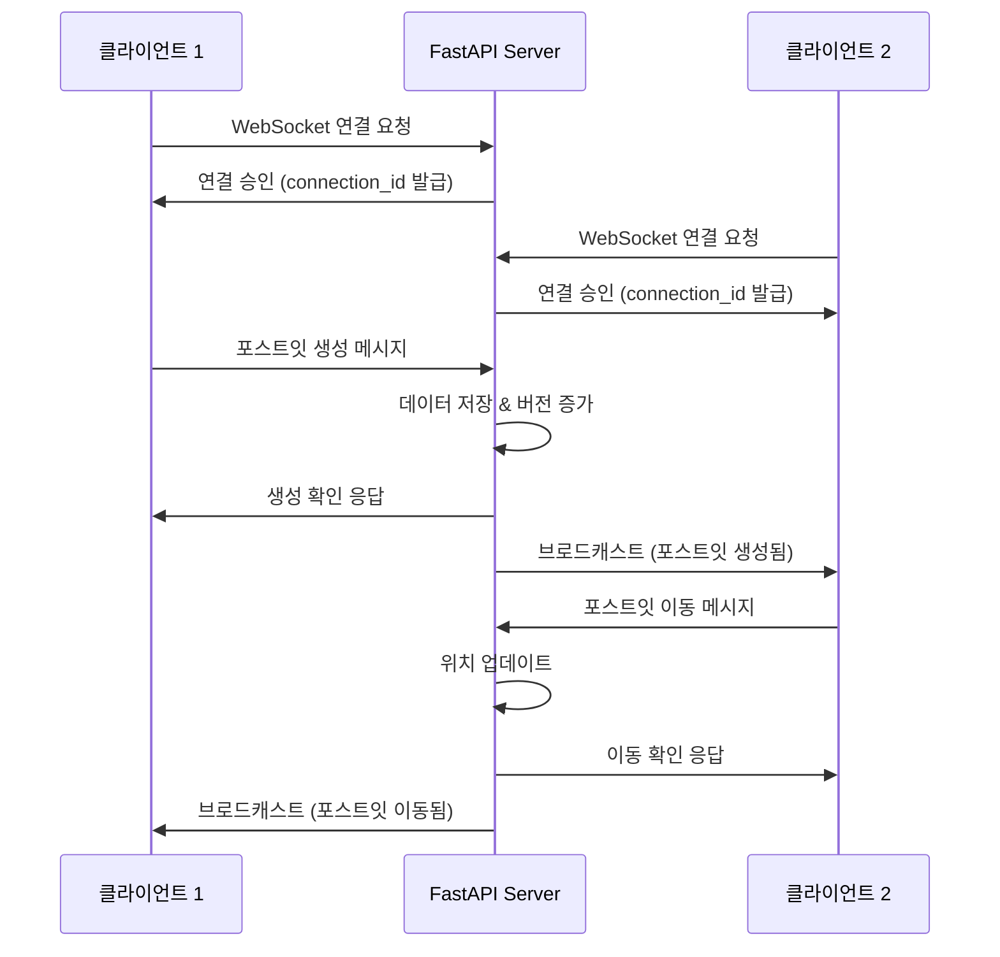
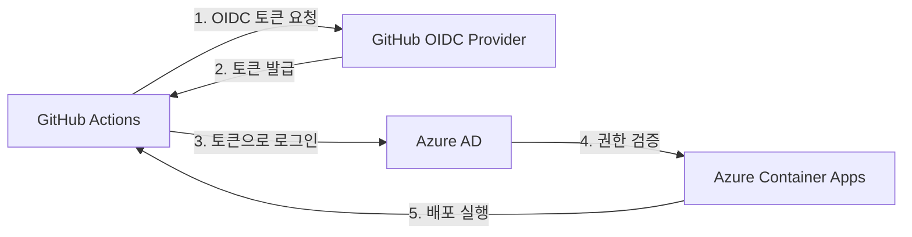

# Introduction · 기술 스택과 아키텍처 이해하기

이 문서에서는 Affinity Diagram App의 **기술적 배경**과 **시스템 아키텍처**를 상세히 다룹니다.

> 💡 전체 개요는 [index.md](./index.md)에서, 실습은 [development.md](./development.md)에서 확인하세요.

## Prerequisites

### 필수 계정
- **GitHub 계정**: 저장소 포크, Codespaces 사용, GitHub Actions 실행에 필요
- **Azure 계정**: Container Apps 배포를 위해 활성 구독 필요 (Lab 1의 크레딧 활용 가능)

### 권장 환경
- **브라우저**: Chrome, Edge, Firefox 최신 버전
- **네트워크**: 안정적인 인터넷 연결 (Codespaces 및 실시간 동기화용)

### 선택 사항
- **GitHub CLI**: 로컬에서 작업할 경우 편리 (Codespaces에서는 불필요)
- **Azure CLI**: 로컬 디버깅 시 유용 (Codespaces에 사전 설치됨)

## Architecture overview

### 애플리케이션 구조

```
┌─────────────────────────────────────────────────────────┐
│                     브라우저 (클라이언트)                  │
│  ┌──────────────────────────────────────────────────┐  │
│  │  React Frontend (Vite)                          │  │
│  │  - TypeScript                                    │  │
│  │  - WebSocket Client                             │  │
│  │  - Drag & Drop UI                               │  │
│  └──────────────────────────────────────────────────┘  │
└──────────────────┬──────────────────────────────────────┘
                   │ HTTP/WebSocket
                   ▼
┌─────────────────────────────────────────────────────────┐
│              FastAPI Backend (Python)                   │
│  ┌──────────────────────────────────────────────────┐  │
│  │  - REST API (CRUD)                              │  │
│  │  - WebSocket Manager                            │  │
│  │  - In-Memory Storage                            │  │
│  └──────────────────────────────────────────────────┘  │
└─────────────────────────────────────────────────────────┘
```

### CI/CD 파이프라인 흐름

```
┌──────────────┐      ┌──────────────┐      ┌──────────────┐
│  코드 Push    │ ───> │ GitHub       │ ───> │  테스트 &    │
│  (main)      │      │  Actions     │      │  빌드        │
└──────────────┘      └──────────────┘      └──────────────┘
                                                    │
                                                    ▼
┌──────────────┐      ┌──────────────┐      ┌──────────────┐
│  Azure       │ <─── │  GHCR에      │ <─── │  Docker      │
│  Container   │      │  이미지 푸시  │      │  이미지 생성  │
│  Apps 배포   │      └──────────────┘      └──────────────┘
└──────────────┘
```

## 🛠️ 기술 스택 상세 설명

### Frontend 기술

| 기술 | 역할 | 사용 이유 |
|------|------|----------|
| **React 18** | UI 라이브러리 | Concurrent 기능으로 실시간 업데이트 최적화 |
| **TypeScript** | 정적 타입 언어 | 런타임 오류 사전 방지, IDE 자동완성 강화 |
| **Vite** | 빌드 도구 | 번개같은 HMR(Hot Module Replacement), ESM 기반 |
| **Tailwind CSS** | 유틸리티 CSS | 빠른 스타일링, 일관된 디자인 시스템 |
| **Framer Motion** | 애니메이션 | 부드러운 드래그 앤 드롭, 제스처 처리 |

### Backend 기술

| 기술 | 역할 | 사용 이유 |
|------|------|----------|
| **FastAPI** | 웹 프레임워크 | 비동기 처리, 자동 문서화, 타입 힌트 기반 검증 |
| **WebSocket** | 실시간 통신 | 양방향 메시지 전송, 낮은 레이턴시 |
| **Pydantic** | 데이터 검증 | JSON 직렬화/역직렬화, 타입 안정성 |
| **Uvicorn** | ASGI 서버 | 고성능 비동기 서버, WebSocket 지원 |

### DevOps 기술

| 기술 | 역할 | 사용 이유 |
|------|------|----------|
| **Docker** | 컨테이너화 | 환경 일관성, 멀티 스테이지 빌드로 이미지 최적화 |
| **GitHub Actions** | CI/CD 파이프라인 | 자동 테스트, 빌드, 배포 - 코드 푸시만으로 완료 |
| **GHCR** | 컨테이너 레지스트리 | GitHub 통합, 무료 이미지 저장소 |
| **Azure Container Apps** | 서버리스 호스팅 | 인프라 관리 불필요, 자동 스케일링, HTTPS 자동 |

## 🔄 실시간 동기화 작동 원리

### WebSocket 연결 흐름



### Connection Manager 구조

```python
# backend/app/connection_manager.py
class ConnectionManager:
    """WebSocket 연결 풀 관리"""
    
    def __init__(self):
        self.active_connections: Dict[str, WebSocket] = {}
    
    async def connect(self, connection_id: str, websocket: WebSocket):
        """새 연결 추가"""
        await websocket.accept()
        self.active_connections[connection_id] = websocket
    
    async def broadcast(self, message: dict, exclude_id: Optional[str] = None):
        """모든 클라이언트에게 메시지 전송 (발신자 제외 가능)"""
        for connection_id, connection in self.active_connections.items():
            if connection_id != exclude_id:
                await connection.send_json(message)
```

### 버전 관리 및 충돌 방지

- **Last Writer Wins (LWW)**: 마지막으로 수정한 사용자의 변경사항이 우선
- **버전 카운터**: 각 포스트잇마다 버전 번호 관리
- **낙관적 동시성 제어**: 충돌 시 클라이언트에게 최신 상태 다시 전송

## 📦 Docker 멀티 스테이지 빌드

### 이미지 최적화 전략

```dockerfile
# Stage 1: Frontend 빌드 (Node.js 18)
FROM node:18-alpine AS frontend-build
WORKDIR /app/frontend
COPY frontend/package*.json ./
RUN npm ci
COPY frontend/ ./
RUN npm run build

# Stage 2: 최종 런타임 (Python 3.12-slim)
FROM python:3.12-slim
WORKDIR /app
COPY backend/requirements.txt ./
RUN pip install --no-cache-dir -r requirements.txt
COPY backend/ ./backend/
COPY --from=frontend-build /app/frontend/dist ./frontend/dist
CMD ["uvicorn", "backend.app.main:app", "--host", "0.0.0.0", "--port", "8000"]
```

**최적화 효과:**
- **빌드 전**: 약 300MB (Node.js + Python 전체 포함)
- **빌드 후**: 약 150MB (런타임만 포함)
- 50% 이미지 크기 감소 → 빠른 배포, 낮은 네트워크 비용

## 🔐 OIDC 기반 무비밀번호 인증

GitHub Actions에서 Azure에 로그인할 때 비밀번호나 액세스 키를 저장하지 않고  
**OpenID Connect (OIDC)** 토큰으로 인증합니다.

### 작동 원리



**장점:**
- ✅ GitHub Secrets에 비밀번호 불필요
- ✅ 토큰은 짧은 시간만 유효 (보안 강화)
- ✅ 권한을 세밀하게 제어 (최소 권한 원칙)

---

## 다음 단계

아키텍처를 이해했다면 이제 실습을 시작하세요!

➡️ **[development.md](./development.md)** - Codespaces에서 앱 실행하기
